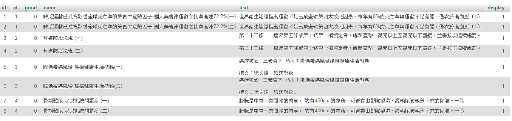

# 建立資料庫

## 文章

新增article資料表，儲存文章  
- `id` 為AUTO_INCREMENT的流水號
- `at` 為類別
- `good` 為讚數
- `name` 為文章標題
- `text` 為內容
- `display` 為是否顯示  

文章類別的數字代號，我是以示意圖裡文章的順序排的  
從 `0` 開始是因為陣列從 `0` 開始  

<ol start="0">
    <li>健康新知</li>
    <li>菸害防制</li>
    <li>癌症防治</li>
    <li>慢性病防治</li>
</ol>
  
在建立資料表時順便匯入預設文章 `02A03.txt` ~ `02A06.txt`  

  

  

## 讚數

新增good資料表，儲存讚  

- `id` 為AUTO_INCREMENT的流水號
- `user` 為使用者帳號
- `article` 為文章ID  

## 問卷調查

新增que資料表，儲存問卷調查  

- `id` 為AUTO_INCREMENT的流水號
- `text` 為題目敘述及選項
- `parent` 為問卷題目
- `vote` 為投票數  
  
在建立資料表時順便匯入預設問卷02A07.txt 

## 使用者帳號

新增user資料表，儲存使用者資料  

- `id` 為AUTO_INCREMENT的流水號
- `acc` 為帳號
- `pw` 為密碼
- `mail` 為信箱  
  
在建立資料表時順便匯入預設使用者02A08.txt  
在新增時將 admin/1234 放在第一筆，ID為1，這樣使用者登入時就可以用ID來判斷是否為管理員帳號，節省資料欄位

## 訪客人數

新增visit資料表，儲存訪客資料   

- `id` 為AUTO_INCREMENT的流水號
- `time` 為日期
- `count` 為訪客數  
  
其實評審不可能考試隔天再開檔案來看，不做日期也沒關係
不過評審有可能要求改系統時間，所以還是做真的比較保險  

