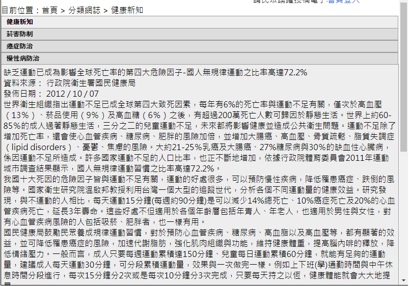

# 分類網誌

:::tip TIP
這裡題目敘述的功能和首頁的標籤頁差不多，只是多了要顯示目前瀏覽文章  
所以直接引用 `main.html` ，再另外寫標籤點擊事件的JS就好  
如果覺得標籤頁長得不像題目規定的 `表列呈現` 的話，另外加個CSS就能解決 
:::

開新檔 `po.php`，製作分類網誌
```php
<!-- 導覽列 -->
目前位置：首頁 > 分類網誌 > <span id="po">健康新知</span>
<br>
<?php include("main.html"); ?>
<script>
	$(".TabbedPanelsTab").click(function(){
		$("#po").text($(this).text())
	})
</script>
<style>
.TabbedPanelsTab {
	float: none !important;
}
</style>
```

