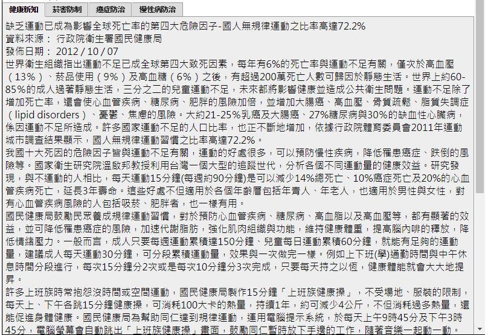

# 主題內容區

編輯主題內容區 main.html

## 製作標籤頁

我考試的考場電腦有附DreamWeaver CS6，用這套軟體快速產生標籤頁  
開啟新檔後， 插入 -> Spry -> Spry標籤面板  
四個標籤名稱在02A02.txt，四個標籤內容各在 `02A03.txt`~`02A06.txt`   
標籤面板完成後在網頁根目錄另存新檔為 `main.html`
  
